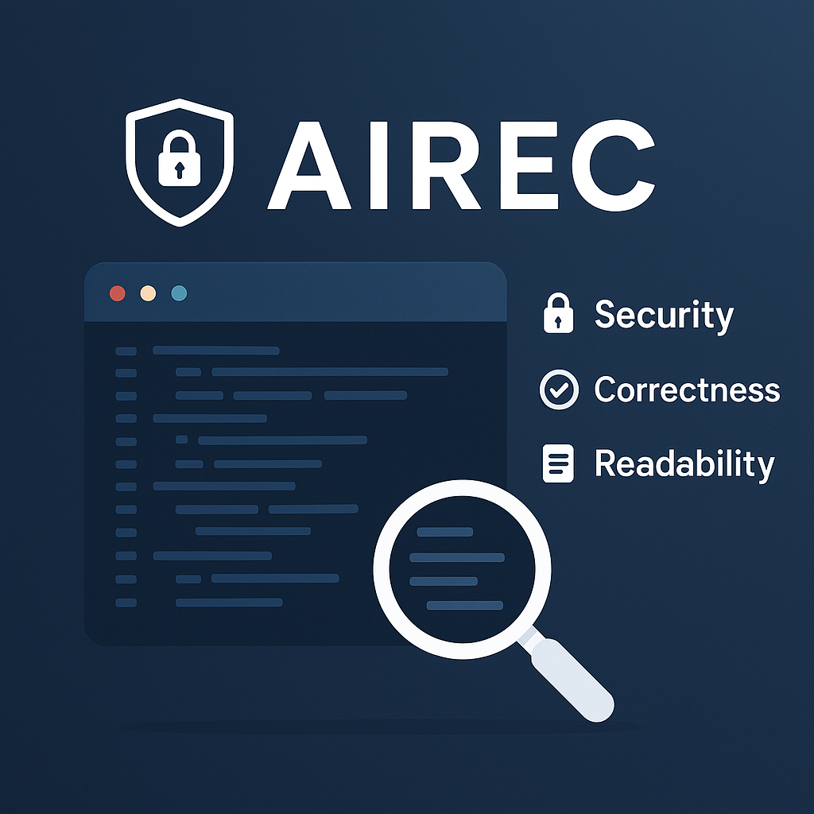

#  AIREC  

**AIREC** is an AI-powered **code analysis tool** designed to evaluate source code based on three core principles: **Readability**, **Correctness**, and **Security**.  

--- 


---

## 🌟 Core Principles

| Principle      | Description |
|----------------|-------------|
| 🔒 **Security** | Detect potential vulnerabilities and protect the code from threats. |
| ✅ **Correctness** | Ensure the code performs exactly as intended. |
| 📝 **Readability** | Evaluate clarity, structure, and maintainability. |

---

## 💡 Highlights

- Automatic code review for both **AI-generated** and **human-written** code.  
- Supports multiple programming languages and paradigms.  
- Provides actionable insights to improve code quality efficiently.  

---

## 🧩 Tech Stack  

- **Backend:** Python, Flask  
- **Frontend:** HTML, CSS, JavaScript  
- **AI Models:** Mistral, Gemini, GPT
- **Environment Management:** pip-tools, `.env`  

---

## 📚 How to Run the Project  
### 🐍 Python Setup (Backend)  

1. Make sure **Python 3.10+** is installed.  

2. Clone the repository:  
   ```bash
   git clone https://github.com/LinoyNP/AIREC-AI-software-Quality.git
3. Navigate into the project directory:
   ```bash
   cd AIREC-AI-software-Quality
4. Create and activate a virtual environment:
   ```bash
   python -m venv venv
   ```
   **On Windows:**
   ```bash
   venv\Scripts\activate
   ```
   **On macOS/Linux:**
   ```bash
   source venv/bin/activate
   ```
5. Install all dependencies:
   ```bash
   pip install -r requirements.txt
   ```
6. Create a file named .env in the project root and add your API keys:
   ```bash
   MISTRAL_API_KEY=your_mistral_key
   HUGGINGFACE_API_KEY=your_huggingface_key
   GEMINI_API_KEY=your_gemini_key
   ```
7. Run the Flask development server:
   ```bash
   python BACKEND.py
   ```
8. Open your browser and go to:
   ```bash
   http://localhost:5001
    ```
---

## 👩‍💻 Contributors
Linoy Nisim Pur  
Noa Shem Tov
